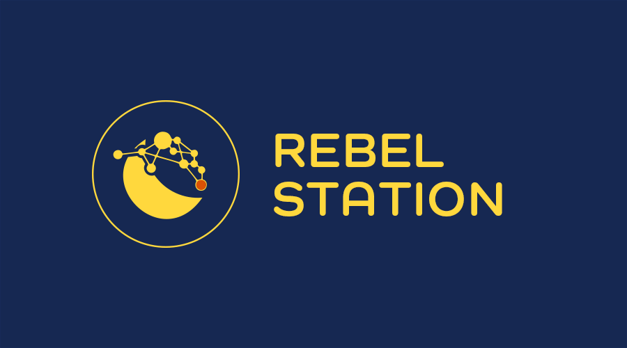

# Station



**Station** is a web application to interact with [Terra Core](https://github.com/terra-money/core) and other supported chains.

Station allows users to:

- View the balances and values of coins and tokens held in the connected wallet.
- View a list of transactions signed by the connected wallet.
- View details of active validators on Terra and supported chains.
- Send tokens to another wallet.
- Swap currencies at the effective exchange rate.
- Stake LUNA or other supported base assets to an active validator or unstake by undelegating.
- Earn rewards generated by staking tokens.
- Participate in governance by voting on proposals and submitting your own.

## Running Station

This project was bootstrapped with [Create React App](https://create-react-app.dev/).

Run Station with the following commands:

```
git clone https://github.com/terra-money/station.git
cd station
npm i
npm run start
```

Runs the app in development mode.
Open http://localhost:3000 to view it in the browser.

> Note: For the Windows operating system, separate the paths by semicolons in the `.env` file.
